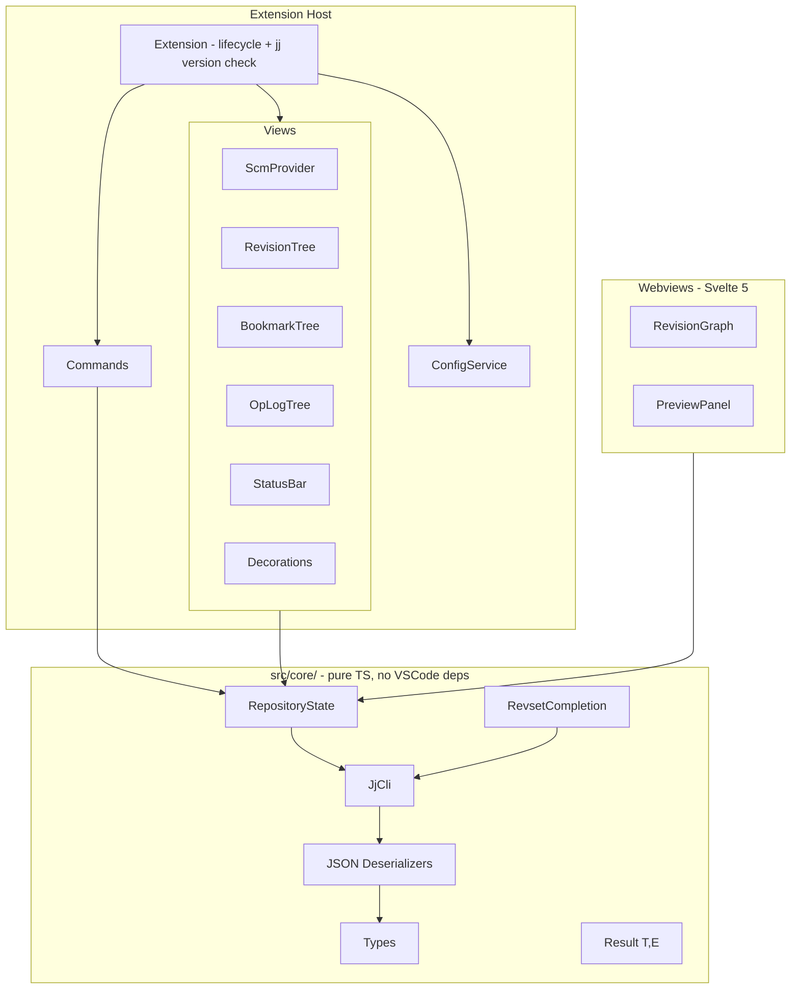
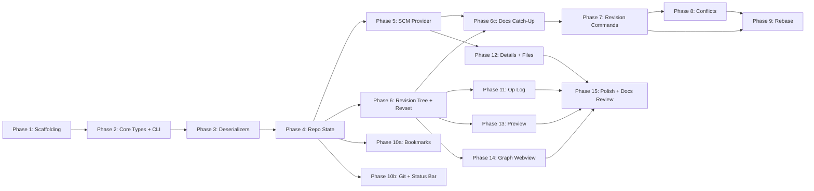

# JJ VSCode/Cursor Extension - Implementation Plan

## Motivation

Jujutsu (jj) is a next-generation VCS with powerful features -- first-class conflicts, automatic rebasing, operation log with undo, and a flexible revset language -- but IDE integration lags behind. Several jj extensions exist for VSCode (jjk, VisualJJ, JJ View, jjq), but none are both open-source AND comprehensive. This extension -- **jjvs** (extension ID `jjvs`, display name "Jujutsu for VSCode", MIT license) -- aims to be the definitive open-source jj extension for VSCode and Cursor, bringing the depth of [jjui](https://github.com/idursun/jjui) (Ibrahim Dursun, MIT license) into VSCode's native UI paradigms.

jjui is the primary inspiration for this project. Its revset completion system, feature scope, and user interaction patterns directly inform our design. Where applicable, algorithms and data structures are ported from jjui's Go implementation to TypeScript. Full attribution is maintained in README.md and source files.

## Technology Stack

- **Language**: TypeScript 5.x, `strict: true`, no `any` coercions
- **Package Manager**: pnpm (compatible with vsce via `--no-dependencies` bundling)
- **Bundler**: esbuild + `esbuild-svelte` plugin (single unified build pipeline for both extension and webviews)
- **Unit Testing**: vitest (for core logic with no VSCode dependency)
- **Integration Testing**: @vscode/test-electron + mocha
- **Linting**: eslint + prettier
- **Dev Environment**: Nix flake with devShell (nodejs_22, pnpm, vsce)
- **VS Code API**: engine `^1.105.0`, `@types/vscode` pinned to match engine version
- **Webview UI**: Svelte 5 (runes API) for graph view and preview panels
- **Minimum jj version**: >= 0.25.0 (requires `json()` template function)

## Architecture

The codebase is split into two layers to maximize testability and separation of concerns:




**Key architectural decisions:**

- `src/core/` has **zero** VSCode imports -- all logic here is unit-testable with vitest
- `Result<T, E>` pattern instead of thrown exceptions for predictable error handling; a clear adapter at the core/vscode boundary converts Results to user-facing error messages
- `JjCli` is an interface so tests can use a mock implementation
- **Structured output via `json()` templates**: Instead of parsing human-readable text, the CLI layer uses jj's template language with `json()` to get machine-readable output. Fallback text parsers exist only for commands that don't support `-T`
- Repository state is observable (event emitter pattern) so UI components react to changes
- **Multi-repo aware from day one**: `RepositoryState` is per-repository, with a `RepositoryManager` that handles discovery and lifecycle. Even if v1 only supports one repo, the data model is not a singleton
- **Colocated vs native detection**: At activation, detect whether the repo is colocated (jj+git) or native jj, and conditionally enable git-specific commands
- All commands go through a `CommandService` that handles error display, progress, and refresh

## Directory Structure

```
jjvs/
  README.md                      # Project motivation, attribution, usage
  CLAUDE.md                      # Agent rules (also serves as AGENTS.md)
  LICENSE                        # MIT
  flake.nix                      # Nix dev environment
  package.json                   # Extension manifest + dependencies
  tsconfig.json                  # TypeScript config (strict)
  esbuild.mjs                   # Unified build script (extension + webviews)
  .vscodeignore                  # Packaging exclusions
  docs/                          # User-facing documentation (see Documentation section)
    index.md                     # Documentation home / landing page
    getting-started/
      installation.md            # Installation and prerequisites
      first-steps.md             # Opening a jj repo, understanding the UI layout
      basic-workflow.md          # Viewing revisions, editing, describing changes
    guides/
      revisions.md               # Creating, editing, abandoning, splitting, squashing
      revsets.md                  # Filtering the revision log with revset expressions
      bookmarks.md               # Managing local and remote bookmarks
      rebasing.md                # Rebase workflows
      conflicts.md               # Understanding and resolving conflicts
      git-integration.md         # Push, fetch, and colocated repo workflows
      operation-log.md           # Undo, redo, and operation history
      multi-root-workspaces.md   # Working with multiple repositories
    reference/
      commands.md                # All commands with keybindings and descriptions
      settings.md                # All extension settings with defaults and examples
      context-keys.md            # When-clause context keys (for keybinding customization)
      revset-functions.md        # Built-in revset functions reference
      keyboard-shortcuts.md      # Default keybindings and how to customize
      troubleshooting.md         # Common problems, diagnostics, and solutions
  src/
    core/
      types.ts                   # Revision, Bookmark, Operation, FileStatus, ConflictState, etc.
      result.ts                  # Result<T, E> utility type
      jj-cli.ts                  # CLI execution abstraction (interface + impl)
      jj-runner.ts               # Process spawning, timeout, cancellation
      jj-version.ts              # Version detection and capability checking
      deserializers/             # JSON deserialization for structured jj output
        log.ts
        status.ts
        bookmark.ts
        op-log.ts
        diff.ts
      revset/                    # Revset completion (ported from jjui)
        completion-provider.ts   # Completion items from functions, aliases, bookmarks, tags
        function-source.ts       # Built-in revset function definitions
        token-parser.ts          # Last-token extraction for prefix matching
      repository.ts              # Per-repo state aggregator
      repository-manager.ts      # Multi-repo discovery and lifecycle
    vscode/
      extension.ts               # activate/deactivate, jj version check
      config.ts                  # Settings wrapper with typed access
      scm/
        provider.ts              # SCM provider (per-repo)
        resource-groups.ts       # Working copy, parent changes
        quick-diff.ts            # QuickDiffProvider
        decorations.ts           # FileDecorationProvider (including conflict state)
      views/
        revisions/
          tree-provider.ts       # Revision log tree
          tree-items.ts          # TreeItem subclasses (with conflict indicators)
          graph-renderer.ts      # Text-based graph characters
        bookmarks/
          tree-provider.ts
        oplog/
          tree-provider.ts
        details/
          tree-provider.ts       # Files in a revision
      commands/
        registry.ts              # Central command registration
        revision-commands.ts     # new, edit, abandon, describe, split, squash, etc.
        rebase-commands.ts       # rebase with mode selection
        bookmark-commands.ts     # move, delete, forget, track, untrack
        git-commands.ts          # push, fetch (colocated only)
        oplog-commands.ts        # restore, undo, redo
        conflict-commands.ts     # resolve, show conflicts
      pickers/
        revision-picker.ts       # QuickPick for selecting revisions (with revset search)
        bookmark-picker.ts
        remote-picker.ts
      webview/
        graph/                   # Svelte 5 app for revision graph
          Graph.svelte
          components/
        preview/                 # Preview panel
          provider.ts
      status-bar.ts              # Current change, bookmark info, conflict count
      file-watcher.ts            # op_heads/ watcher with self-command suppression
      output-channel.ts          # Logging
  test/
    unit/                        # vitest tests (mirrors src/core/)
      deserializers/
      revset/
      result.test.ts
      jj-cli.test.ts
    integration/                 # @vscode/test-electron tests
      scm.test.ts
      commands.test.ts
  webview-ui/                    # Svelte 5 source for webview panels
    graph/
    preview/
```

## Feature Mapping: jjui to VSCode

- **Revision tree** -> Tree View (`revisions` view in SCM sidebar) + optional Graph Webview panel
- **Rebase** -> Command palette + QuickPick for source mode/target selection
- **Squash** -> Command palette + revision picker
- **Details view** -> Separate tree view (files in revision) + click to open diff
- **Preview** -> Webview panel or virtual document in editor
- **Bookmarks** -> Tree view with context menu actions
- **Op Log** -> Tree view with restore/revert context actions
- **Undo/Redo** -> Commands (Ctrl+Z style or command palette)
- **Git push/fetch** -> Commands + status bar buttons (colocated repos only)
- **Diff view** -> Built-in VSCode diff editor
- **Revset input** -> InputBox with completions (functions, aliases, bookmarks, tags, history -- ported from jjui's approach)
- **Describe** -> SCM input box + command for editor-based editing
- **Ace jump** -> QuickPick with fuzzy matching on change IDs
- **File search** -> Leverages VSCode's built-in file picker
- **Status bar** -> StatusBarItems showing current change ID, bookmarks, conflict count
- **Conflicts** -> Conflict indicators in tree view, conflict markers in editor, `jj resolve` integration

## Revset Completion Design (inspired by jjui)

The revset completion system is ported from [jjui's implementation](https://github.com/idursun/jjui/tree/main/internal/ui/revset) (MIT license, Ibrahim Dursun). The approach is pragmatic -- no full grammar parsing, just token-boundary detection and prefix matching:

**Completion sources** (matching jjui's `source.Source` pattern):

- **Static**: Built-in revset functions (hardcoded list with names, parameter info, signature help) and user-defined aliases from `jj config get revset-aliases`
- **Dynamic**: Bookmarks and tags fetched from the repo at completion time
- **History**: Session-scoped revset input history

**Token parsing**: Split input on delimiters (`space , | & ~ ( . :`), extract the last token, prefix-match against all sources. No grammar awareness needed.

**VSCode integration**: Presented as a QuickPick with categorized items (function/alias/bookmark/tag/history pills), signature help shown for functions. The revset input also serves as the filter for the revision tree view.

## Configuration (extension settings)

Following jjui's config model, exposed as `jjvs.`* settings:

- `jjvs.jjPath` - path to jj binary (default: `"jj"`)
- `jjvs.logLevel` - output channel verbosity (`off`, `error`, `warn`, `info`, `debug`, `trace`; default: `"info"`)
- `jjvs.revset` - default revset expression
- `jjvs.logTemplate` - custom log template (overrides built-in json template)
- `jjvs.logLimit` - max revisions to show (default: 50, batched)
- `jjvs.oplogLimit` - max operations (default: 200)
- `jjvs.git.defaultRemote` - default git remote (default: `"origin"`)
- `jjvs.preview.position` - preview panel position (`auto`, `beside`, `below`)
- `jjvs.preview.showOnStart` - auto-open preview (default: false)
- `jjvs.autoRefresh` - auto-refresh on file system changes (default: true)
- `jjvs.autoRefreshInterval` - polling fallback interval in ms (default: 3000)
- `jjvs.graphStyle` - graph rendering style (`text`, `webview`)

---

## User Documentation

Documentation is a first-class deliverable, not a Phase 15 afterthought. Each feature phase
includes documentation alongside the code it ships, so the extension is always documented to
the level of its current functionality.

### Documentation Architecture (Diataxis)

The documentation follows the [Diataxis framework](https://diataxis.fr/), which organizes
technical documentation into four distinct types based on the reader's needs:


| Type                | Purpose                            | Reader's mode                      | Location                            |
| ------------------- | ---------------------------------- | ---------------------------------- | ----------------------------------- |
| **Getting Started** | Learning-oriented tutorials        | "I'm new, walk me through it"      | `docs/getting-started/`             |
| **Guides**          | Task-oriented how-to articles      | "I need to accomplish X"           | `docs/guides/`                      |
| **Reference**       | Information-oriented lookup tables | "What are the exact details of Y?" | `docs/reference/`                   |
| **Troubleshooting** | Problem-oriented diagnostics       | "Something went wrong"             | `docs/reference/troubleshooting.md` |


Each type serves a different purpose and should not be mixed. A tutorial should not
double as a reference; a how-to guide should not try to teach concepts from scratch.

### Getting Started (`docs/getting-started/`)

Three documents that take a new user from zero to productive:

1. `**installation.md`** — Prerequisites (VSCode/Cursor version, jj version), installation
  from marketplace or `.vsix`, verifying the extension activated correctly, configuring
   `jjvs.jjPath` if jj is not on `PATH`.
2. `**first-steps.md`** — Opening a jj repository in VSCode, understanding the UI layout
  (activity bar icon, Revisions/Bookmarks/Operation Log views, SCM view, status bar),
   the relationship between jj's working copy and what the extension shows.
3. `**basic-workflow.md`** — A guided walkthrough of the most common workflow: viewing the
  revision log, making changes to files, describing changes via the SCM input box,
   creating a new revision, filtering with a simple revset. This should be concrete and
   example-driven, using a sample repository the reader can follow along with.

### Guides (`docs/guides/`)

Task-oriented articles, each focused on accomplishing one specific workflow. Every guide
follows the same structure: a one-sentence statement of what the guide covers, prerequisites,
step-by-step instructions, and a "what next?" link to related guides or reference material.


| Guide                          | Covers                                                                                                                                            |
| ------------------------------ | ------------------------------------------------------------------------------------------------------------------------------------------------- |
| `**revisions.md`**             | Creating (`jj new`), editing, abandoning, describing (inline and editor-based), duplicating, splitting, and squashing revisions                   |
| `**revsets.md`**               | Using the revset input to filter the revision log; autocomplete for functions, aliases, bookmarks, and tags; common revset patterns               |
| `**bookmarks.md`**             | Browsing bookmarks in the tree view, creating, moving, deleting, tracking/untracking remote bookmarks                                             |
| `**rebasing.md`**              | The multi-step rebase flow (source mode, target, position), handling conflicts that arise from rebase                                             |
| `**conflicts.md`**             | Understanding jj's first-class conflict model, identifying conflicted revisions, resolving conflicts with the merge tool, the resolution workflow |
| `**git-integration.md`**       | Push and fetch for colocated repos, remote selection, authentication troubleshooting, understanding what "colocated" means                        |
| `**operation-log.md`**         | Browsing the operation log, restoring a previous state, undo and redo                                                                             |
| `**multi-root-workspaces.md`** | How jjvs handles multiple jj repositories in a multi-root VSCode workspace                                                                        |


### Reference (`docs/reference/`)

Exhaustive, lookup-oriented documentation. The reference section should be complete — every
command, setting, and keybinding the extension provides must be documented here, even if it's
also mentioned in a guide.


| Reference                   | Covers                                                                                                                                           |
| --------------------------- | ------------------------------------------------------------------------------------------------------------------------------------------------ |
| `**commands.md`**           | Every registered command with its ID, title, default keybinding (if any), enablement condition, and a one-sentence description                   |
| `**settings.md`**           | Every `jjvs.`* setting with its type, default, valid values, scope, and a description (mirrors `package.json` but with examples and usage notes) |
| `**context-keys.md`**       | All `jjvs:`* when-clause context keys, their types, when they're set, and how users can reference them in custom keybindings                     |
| `**revset-functions.md`**   | Built-in revset functions recognized by the autocomplete, with signatures and descriptions (generated from `function-source.ts` data)            |
| `**keyboard-shortcuts.md`** | Default keybindings, how to customize them, available when-clause contexts for scoping                                                           |
| `**troubleshooting.md`**    | Common problems (jj not found, version too old, colocated detection fails, extension not activating), diagnostic steps, and solutions            |


### Documentation Principles

- **Docs are written when the feature ships, not later.** Each implementation phase that
adds user-facing functionality includes a documentation deliverable. This prevents
documentation debt from accumulating.
- **Accuracy over completeness.** It is better to have a short, accurate document than a
long one that describes behavior the extension doesn't yet have. Never document features
from future phases — if a guide references a feature not yet implemented, omit that
section and add a `<!-- TODO(phase-N): add section on X -->` comment.
- **Screenshots and examples use real jj repos.** All screenshots and example outputs
should come from running the extension against a real jj repository, not mockups.
Document which jj version and repo state produced the screenshot.
- **Reference is generated where possible.** The commands and settings reference pages
should be verifiable against `package.json` contribution points. When commands or
settings are added, both `package.json` and the reference docs are updated in the same
phase.
- **Cross-link between types.** Guides should link to relevant reference pages ("For the
full list of revset functions, see [Revset Functions Reference](../reference/revset-functions.md)").
The getting-started tutorial should link to guides for deeper dives.
- **Plain Markdown.** Documentation is plain Markdown files in `docs/`. No static site
generator is required for v1. The structure is designed so a static site generator
(e.g., VitePress, mdBook) can be added later without restructuring content.

---

## Implementation Phases

### Phase 1: Project Scaffolding and Dev Environment ✅

**1 invocation** - Sets up the entire project skeleton so all subsequent work has a foundation.

- `README.md` -- project documentation for humans (see content spec below)
- `CLAUDE.md` -- agent rules and development principles (see content spec below)
- `flake.nix` with devShell (nodejs_22, pnpm, vsce, typescript)
- `.envrc` for direnv integration
- `package.json` with extension manifest (`engines.vscode: "^1.105.0"`), scripts, dependencies
- `tsconfig.json` (strict mode, ES2022, `"moduleResolution": "bundler"` — correct for esbuild-bundled projects; avoids `.js` extension requirement while keeping modern resolution semantics)
- `esbuild.mjs` unified build script (extension host entry + webview entries, with esbuild-svelte plugin)
- `eslint.config.mjs` (flat config, ESLint 9+/10+; `.mjs` avoids CommonJS/ESM module system ambiguity since package.json has no `"type": "module"`) + `.prettierrc`
- `.vscodeignore`, `.gitignore`
- Vitest config for unit tests
- Basic `src/vscode/extension.ts` that activates and logs
- Activation events: `workspaceContains:.jj` and `onCommand:jjvs.`*
- Basic `package.json` contribution points (empty commands, views)
- ~~**Documentation scaffold**: `docs/index.md` (landing page with structure overview and status),
`docs/getting-started/installation.md` (prerequisites and installation instructions),
stub files for all other documentation pages with `<!-- TODO(phase-N) -->` markers~~
*(deferred to Phase 6c)*

#### README.md Content

- **Project motivation**: jj is a powerful VCS with poor IDE integration; existing extensions are either closed-source or incomplete; jjvs aims to be the definitive open-source jj extension for VSCode/Cursor
- **Feature overview**: revision tree, SCM integration, revset completion, bookmarks, op log, conflict handling, rebase, git push/fetch, graph webview
- **Attribution**: inspired by and partially derived from [jjui](https://github.com/idursun/jjui) by Ibrahim Dursun (MIT license); revset completion system ported from jjui's Go implementation; feature scope and interaction patterns informed by jjui's design
- **Requirements**: VSCode >= 1.105.0 or Cursor >= 2.6.x; jj >= 0.25.0
- **Installation / Development / Contributing** sections (stubs for Phase 1, fleshed out in Phase 15)
- **License**: MIT
- **No telemetry**: state explicitly that the extension collects no telemetry or analytics

#### CLAUDE.md Content

This file serves as both CLAUDE.md and AGENTS.md. It captures principles, process rules, and architectural constraints that apply to all development on this project, whether by a human or an AI agent.

**Priorities** (in order):

1. Correctness over speed
2. Clarity over cleverness
3. Testability over convenience

**Verification principles**:

- **Verify claims from primary sources.** Never trust blog posts, forum discussions, or web search summaries for version numbers, API availability, or compatibility claims. Check actual binaries (`product.json`), official changelogs, or source code. When a version or capability claim is added to the codebase (in code, comments, or docs), cite the primary source.
- **Understand the wrapped tool before designing abstractions.** Before building any layer that wraps jj CLI output, run the actual commands against a real repo and inspect the real output. Before using a VSCode API, read the `.d.ts` type definitions, not just tutorials. Before adopting a third-party library, read its source or at least its type signatures.
- **Research prior art before building.** Check how jjui, existing jj extensions, and the git extension handle similar problems. Attribute and reuse (with license compliance) rather than reinventing.
- **Test deserializers against real jj output.** Capture actual jj command output as test fixtures. Document which jj version produced each fixture. When jj releases a new version, re-capture fixtures and verify deserializers still work.

**TypeScript rules**:

- `strict: true`, no `any` coercions, no type assertions (`as`) unless justified with an adjacent comment explaining why
- Prefer `readonly` on properties and parameters where possible
- Exhaustive `switch` via `never` default checks
- No abbreviations in identifiers (`revision` not `rev`, `bookmark` not `bm`, `description` not `desc`) -- except where matching jj's own terminology (e.g., `revset`, `oplog`)
- Prefer named exports over default exports
- All public APIs documented with JSDoc

**Architecture rules**:

- **Core/VSCode boundary is enforced mechanically.** `src/core/` has zero VSCode imports. This is enforced by an ESLint `no-restricted-imports` rule that bans `vscode` in `src/core/`**. Do not weaken or bypass this rule.
- **Result in core, user-facing errors in vscode.** Core functions return `Result<T, E>`. The VSCode layer unwraps Results via a centralized adapter that converts errors to notifications, output channel logs, or actionable quick-fix messages. Never throw exceptions in `src/core/`.
- **Multi-repo by default.** `RepositoryState` is per-repository. `RepositoryManager` handles discovery and lifecycle. Never use module-level singletons for repo state, even if only one repo is supported today.
- **Structured output first.** Use `json()` templates for jj commands that support `-T`. Fallback text parsers only for commands that don't. When jj adds `-T` support to a new command, migrate the corresponding deserializer from text to JSON.
- **Commands go through CommandService.** All user-facing commands are registered via `CommandService`, which handles progress indication, error display, and post-command refresh. Never call jj directly from a command handler.
- **Self-command suppression for file watching.** The file watcher ignores FS events during extension-initiated jj commands to prevent feedback loops. This is not optional -- every code path that invokes jj must use the suppression guard.

**Error handling and resilience**:

- **Graceful degradation.** If jj returns unexpected output, degrade gracefully (show partial data, log a warning to the output channel) rather than crashing or showing empty UI. If a feature requires a jj version newer than the user's, disable that feature with an explanatory message rather than erroring.
- **Cancellation is first-class.** Long-running jj commands (especially on large repos) must support cancellation via `AbortController`. The runner, CLI layer, and CommandService all propagate cancellation. A cancelled command is not an error -- it should produce no side effects.
- **Version-gated capabilities.** Use the `jj-version.ts` capability flags to conditionally enable features. When adding a new jj command usage, document the minimum jj version that supports it.

**Testing rules**:

- Every deserializer and core utility must have unit tests
- Test files in `test/unit/` mirror `src/core/` directory structure
- Use vitest `describe`/`it` blocks with descriptive names that read as specifications
- Integration tests use real jj repos created in temp directories (not mocks)
- Test fixtures are real jj output captured from actual commands, with the jj version noted in a comment

**Code style**:

- ESLint 9+/10+ flat config (`eslint.config.mjs`) + Prettier enforced (CI fails on violations)
- Conventional commits: `feat:`, `fix:`, `refactor:`, `test:`, `docs:`, `chore:`
- No comments that just narrate what code does; comments explain *why* or document non-obvious constraints
- When porting code from jjui, add an attribution comment at the top of the file: `// Ported from jjui (MIT License, Ibrahim Dursun): <original file path>`

**Concurrency and command serialization**:

- jj uses workspace-level locking. The extension must **serialize jj command execution per repository** via a command queue. Never fire-and-forget multiple commands concurrently against the same repo. The `CommandService` owns this queue.
- Read-only commands (`jj log`, `jj status`, `jj show`) may run concurrently with each other but must wait for any in-flight mutating command to complete. Mutating commands (`jj new`, `jj rebase`, `jj squash`, etc.) are fully serialized.
- If a user triggers a command while another is running, either queue it (for non-interactive commands) or show "A jj operation is in progress" (for interactive commands like rebase).

**Disposable discipline**:

- Every event listener, file watcher, webview panel, status bar item, tree view registration, and command registration must be tracked as a `vscode.Disposable` and cleaned up on deactivation.
- Use a typed `DisposableStore` utility (array of disposables with a single `dispose()` method) rather than tracking individual disposables. Each service class should own a `DisposableStore` and register it with the extension context.
- Forgetting to dispose a file watcher or event listener is a resource leak. The `DisposableStore` pattern makes this hard to forget.

**When-clause context keys**:

- Use `vscode.commands.executeCommand('setContext', key, value)` to drive menu visibility and command enablement. All context keys are documented in one place (e.g., `jjvs:hasRepository`, `jjvs:isColocated`, `jjvs:hasConflicts`, `jjvs:revisionSelected`).
- Context keys are the mechanism for progressive disclosure: git-specific commands appear only in colocated repos, conflict commands appear only when conflicts exist, etc.
- Never use context keys for state that changes rapidly (e.g., not for "is refreshing"). Only for stable UI state.

**Debounced refresh**:

- Multiple file system events or sequential user commands should not trigger N separate refreshes. Implement a debounce/coalesce layer in `RepositoryState` that batches rapid changes into a single refresh cycle (e.g., 100ms debounce window).
- After a mutating jj command completes, do one explicit refresh rather than relying on the file watcher (which may fire multiple times as op_heads/ is updated).

**Webview security**:

- All webviews must set a Content Security Policy restricting script sources to nonce-based inline scripts and the webview's own resource URI.
- Communication between extension host and webview is exclusively through `postMessage` / `onDidReceiveMessage`. Define a typed message protocol (discriminated union of message types) shared between extension and webview code.
- No `eval()`, no inline event handlers, no external resource loading. These are enforced by CSP and are also requirements for marketplace review.

**Webview theming**:

- Svelte webview components must use VSCode CSS custom properties (`--vscode-editor-background`, `--vscode-editor-foreground`, `--vscode-button-background`, etc.) for all colors and fonts. Never hardcode colors.
- This ensures automatic dark/light/high-contrast theme support with zero additional code. The VSCode webview API injects these variables automatically.
- Test webviews in at least three themes: a light theme, a dark theme, and high contrast.

**Performance boundaries**:

- For repos with many revisions (1000+), enforce lazy loading with configurable batch size. The tree view uses pagination ("Load more..." nodes) rather than loading all revisions at once.
- Webview graph should use virtual scrolling or canvas rendering for large DAGs. DOM-based rendering is acceptable up to ~500 nodes; beyond that, use a virtualization strategy.
- All jj commands that might be slow on large repos (log, diff on large changesets) must use the cancellation mechanism. Show progress for any command taking > 500ms.
- Debounce revset input so the extension doesn't run `jj log` on every keystroke -- wait for a pause (e.g., 300ms).

**Logging strategy**:

- Use a structured logging approach via the output channel. Include a `jjvs.logLevel` setting (`off`, `error`, `warn`, `info`, `debug`, `trace`; default `info`).
- Log all jj commands with their arguments at `debug` level and their duration at `info` level for slow commands (> 1s). Never log file contents or sensitive data.
- On activation, log the detected jj version, repo path(s), and colocated/native status at `info` level.

**Accessibility**:

- Webview components must include ARIA labels and roles for interactive elements. Keyboard navigation (Tab, Enter, Escape, arrow keys) must work for all interactive webview elements.
- Tree items must have meaningful `accessibilityInformation` (description and role) for screen readers.
- All icon-only buttons must have `tooltip` set. Color alone must never be the only indicator of state (e.g., conflict state needs both an icon and a color).

**No telemetry**:

- The extension collects no telemetry, analytics, or usage data. This is a project principle, not just a README bullet point. Do not add optional telemetry, crash reporting, or usage tracking.

**Incremental delivery**:

- Each phase should produce a **shippable** (if incomplete) extension. Never leave the extension in a broken state between phases. After Phase 5, the extension should be usable as a basic SCM provider. After Phase 7, it should handle the most common jj workflows.
- Features that aren't ready yet should be absent from the UI, not present but broken. Use feature flags (via version-gated capabilities and when-clause context keys) to hide incomplete features.

**Snapshot testing for deserializers**:

- Use vitest snapshot tests for deserializer output. When jj output format changes across versions, snapshots make it immediately obvious what broke and what the new shape looks like.
- Capture real jj output as `.fixture.json` or `.fixture.txt` files in the test directory. Each fixture is annotated with the jj version that produced it.

**Tools**:

- pnpm for package management
- esbuild + esbuild-svelte for all bundling (extension + webviews)
- vitest for unit tests, @vscode/test-electron + mocha for integration tests
- Nix flake for reproducible dev environment

**Minimum supported versions** (with rationale):

- VSCode: `^1.105.0` -- verify actual Cursor engine version from `product.json` before finalizing; target the oldest engine version that supports all APIs we need
- jj: `>= 0.25.0` -- required for `json()` template function
- Node.js: 22.x -- matches Nix flake devShell

### Phase 2: Core Types, Result Pattern, and JJ CLI Client ✅

**2 invocations** - The foundation layer everything else depends on.

- Invocation 2a: `src/core/types.ts` (Revision with ConflictState, FileChange, Bookmark, Operation, RepoKind enum for colocated/native), `src/core/result.ts` (Result type with map/flatMap/match), `src/core/jj-runner.ts` (process spawning with cancellation, timeout, streaming)
- Invocation 2b: `src/core/jj-cli.ts` (typed interface for every jj command using `json()` templates for structured output: log, status, show, diff, bookmark list, op log, etc.), `src/core/jj-version.ts` (version detection, capability flags), unit tests for runner and CLI mocking

### Phase 3: JSON Deserializers ✅

**1 invocation** - Deserialize structured jj output into typed structures. Dramatically simpler than text parsing because the CLI layer uses `json()` templates.

- `src/core/deserializers/log.ts` - deserialize `jj log` JSON output
- `src/core/deserializers/status.ts` - deserialize `jj status` output (still text-based, no `-T` support)
- `src/core/deserializers/bookmark.ts` - deserialize `jj bookmark list` JSON output
- `src/core/deserializers/op-log.ts` - deserialize `jj op log` JSON output
- `src/core/deserializers/diff.ts` - deserialize `jj diff --stat` and `jj diff` (text-based, used for display)
- Each deserializer has unit tests with fixture data
- Fallback text parsers only for commands that don't support `-T`

### Phase 4: Repository State and File Watching ✅

**1 invocation** - Central state management that all UI components observe.

- `src/core/repository.ts` - RepositoryState class (observable, caches revision list, status, bookmarks, conflict count)
- `src/core/repository-manager.ts` - Multi-repo discovery (finds `.jj/` directories in workspace roots), manages RepositoryState instances
- `src/vscode/file-watcher.ts` - watches `.jj/repo/op_heads/` specifically (not all of `.jj/`), with self-command suppression guard (ignores FS events during extension-initiated jj commands), configurable polling fallback
- `src/vscode/config.ts` - typed settings access with change detection
- `src/vscode/output-channel.ts` - logging infrastructure
- jj version check at activation: warn if below minimum version, log detected version, set capability flags

### Phase 5: SCM Provider ✅

**2 invocations** - The primary integration point with VSCode's Source Control view.

- Invocation 5a: SCM provider registration (one per discovered repo), resource groups (working copy changes grouped by status), file decorations (modified/added/deleted/conflicted indicators in explorer), colocated vs native detection (conditionally show git commands)
- Invocation 5b: QuickDiffProvider (inline gutter diff), SCM input box for `jj describe`, commit action
- ~~**Documentation**: Complete `docs/getting-started/first-steps.md` (UI layout, what each view shows) and `docs/getting-started/basic-workflow.md` (viewing changes, describing via SCM input box). Start `docs/reference/settings.md` with the settings available so far.~~
*(deferred to Phase 6c)*

### Phase 6: Revision Log Tree View ✅

**2 invocations** - The main navigation view for the extension.

- Invocation 6a: TreeDataProvider showing revision log with graph characters, change ID, author, description, bookmarks as badges, **conflict indicators** (icon/color for conflicted revisions); context menu actions; auto-refresh
- Invocation 6b: Revset completion system (ported from jjui):
  - `src/core/revset/completion-provider.ts` - CompletionProvider with static sources (functions, aliases) and dynamic sources (bookmarks, tags)
  - `src/core/revset/function-source.ts` - Built-in revset function definitions with signature help (ported from jjui's `function_source.go`)
  - `src/core/revset/token-parser.ts` - Last-token extraction by splitting on delimiters
  - VSCode QuickPick integration with categorized items, session history, signature help display
  - Filtering the revision tree via revset input
  - Batched/paginated loading
- ~~**Documentation**: Write `docs/guides/revsets.md` (revset input, autocomplete, common patterns). Write `docs/reference/revset-functions.md` (all built-in functions with signatures). Expand `docs/getting-started/basic-workflow.md` to mention filtering by revset.~~
*(deferred to Phase 6c)*

### Phase 6c: Documentation Catch-Up (Phases 1–6b)

**1 invocation** - Phases 1 through 6b were implemented before documentation requirements
were established. This catch-up phase writes all documentation that would have been delivered
incrementally had the docs framework been in place from the start.

Deliverables:

- **Scaffold** (from Phase 1):
  - `docs/index.md` — landing page with overview of the documentation structure, current
  feature status, and links to all sections
  - `docs/getting-started/installation.md` — prerequisites (VSCode/Cursor version, jj version),
  installation from marketplace or `.vsix`, verifying activation, configuring `jjvs.jjPath`
  - Stub files for all remaining `docs/` pages with `<!-- TODO(phase-N) -->` markers so the
  directory structure exists and cross-links don't break
- **Getting Started** (from Phase 5):
  - `docs/getting-started/first-steps.md` — opening a jj repository, understanding the UI
  layout (activity bar, Revisions/Bookmarks/Op Log views, SCM view, status bar), the
  relationship between jj's working copy and the extension's display
  - `docs/getting-started/basic-workflow.md` — guided walkthrough: viewing the revision log,
  making file changes, describing changes via the SCM input box, creating a new revision,
  filtering with a simple revset expression
- **Guides** (from Phase 6):
  - `docs/guides/revsets.md` — using the revset input to filter the revision log, autocomplete
  for functions/aliases/bookmarks/tags, common revset patterns with examples
- **Reference** (from Phases 5–6):
  - `docs/reference/settings.md` — all `jjvs.`* settings currently in `package.json`, with
  types, defaults, valid values, scope, and usage notes
  - `docs/reference/revset-functions.md` — all built-in revset functions recognized by the
  autocomplete, with signatures and descriptions (derived from `function-source.ts`)
  - `docs/reference/commands.md` — all commands currently registered in `package.json`, with
  IDs, titles, enablement conditions, and descriptions (stub; will grow in later phases)

After this phase, the extension is documented to the level of its current functionality and
all subsequent phases resume the incremental documentation approach.

### Phase 7: Core Revision Commands

**2 invocations** - The bread-and-butter operations.

- Invocation 7a: Command registry pattern, revision picker (QuickPick with revset search), commands: `new`, `edit`, `abandon`, `describe` (inline + editor), `duplicate`
- Invocation 7b: `split` (with file picker for interactive split), `squash` (with target picker), `revert`, `absorb`, progress indicators, error handling with actionable messages
- **Documentation**: Write `docs/guides/revisions.md` (all revision operations with step-by-step instructions). Update `docs/reference/commands.md` with all new commands. Start `docs/reference/keyboard-shortcuts.md`.

### Phase 8: Conflict Handling

**1 invocation** - jj's first-class conflict model is a key differentiator and deserves dedicated treatment.

- Conflict state indicators in revision tree (distinct icon/color for conflicted commits)
- Conflict count in status bar (how many revisions in the current view are conflicted)
- `jj resolve` integration (launch external merge tool from context menu or command)
- Conflict markers visualization when viewing conflicted files in the editor
- Conflict resolution workflow guidance: check out conflicted commit -> edit -> squash resolution back
- Auto-rebase conflict cascade awareness: after rebase, highlight which descendants gained conflicts
- **Documentation**: Write `docs/guides/conflicts.md` (understanding jj conflicts, identifying them in the UI, resolution workflow). This guide is especially important because jj's conflict model differs fundamentally from git's and users need conceptual grounding.

### Phase 9: Rebase

**1 invocation** - Complex but well-scoped feature.

- Rebase command with multi-step QuickPick flow: select source mode (revision/branch/descendants) -> select target -> select position (onto/after/before/insert)
- Error handling for conflicts with actionable messages (e.g., "Rebase created conflicts in 3 revisions. Open conflict view?")
- No drag-and-drop in tree view (TreeView DnD API is too limited for rebase semantics; reserved for graph webview in Phase 14)
- **Documentation**: Write `docs/guides/rebasing.md` (the multi-step rebase flow, source modes, handling rebase conflicts). Update `docs/guides/conflicts.md` to cross-link rebase-related conflict scenarios.

### Phase 10: Bookmarks and Git Integration

**2 invocations**

- Invocation 10a: Bookmarks tree view (local + remote, grouped), context menu: move, delete, forget, track, untrack; create bookmark command
- Invocation 10b: Git push/fetch commands (enabled only for colocated repos, hidden for native jj), remote picker, status bar items (current change ID, bookmark, push/fetch buttons), credential/authentication error handling with guidance
- **Documentation**: Write `docs/guides/bookmarks.md` (browsing, creating, moving, tracking remote bookmarks). Write `docs/guides/git-integration.md` (push/fetch, remote selection, colocated vs native repos, authentication). Update `docs/reference/commands.md` and `docs/reference/settings.md` with new commands and settings.

### Phase 11: Op Log, Undo/Redo

**1 invocation**

- Op log tree view showing operations with timestamps and descriptions
- Restore and revert operations from context menu
- Undo/redo commands that map to `jj undo` / `jj op restore`
- **Documentation**: Write `docs/guides/operation-log.md` (browsing operations, undo/redo, restoring previous state). Update `docs/reference/commands.md`.

### Phase 12: Revision Details View and File Operations

**2 invocations**

- Invocation 12a: Details tree view showing files changed in a revision, click to open diff in editor, file status icons (including conflict markers)
- Invocation 12b: File-level operations: restore file, split by file, squash by file, show revisions changing a file; evolog view
- **Documentation**: Update `docs/guides/revisions.md` with file-level split and squash operations. Update `docs/reference/commands.md` with new commands.

### Phase 13: Preview Panel

**1 invocation**

- Webview-based preview panel showing `jj show` / `jj diff` output with ANSI color rendering
- Position configuration (beside, below)
- Auto-update when selection changes in tree view
- Scroll synchronization

### Phase 14: Revision Graph Webview

**2 invocations** - The most visually complex feature. Deferred to later phases because the text-based graph in the tree view (Phase 6) provides functional parity; this adds visual richness.

- Invocation 14a: Svelte 5 app setup (built via esbuild-svelte in the unified build), DAG layout algorithm, data protocol between extension and webview, click to select revision, context menus, bookmark pills, current change highlight, conflict indicators
- Invocation 14b: Interactive features: drag-and-drop rebase (the proper place for DnD, not the tree view), zoom/pan

### Phase 15: Polish, Testing, and Documentation Review

**2 invocations** - Final pass, but note that unit tests and docs are written alongside each phase above.

- Invocation 15a:
  - Comprehensive settings validation
  - Keyboard shortcut contributions (when clauses for jj-specific contexts)
  - Tooltips on all tree items and status bar items
  - Integration test suite (end-to-end with real jj repos)
  - CI setup (GitHub Actions)
  - Packaging verification (`vsce package` + install test)
  - CONTRIBUTING.md
- Invocation 15b: Documentation review and completion
  - Audit all `docs/` pages: remove `<!-- TODO -->` stubs for shipped features, verify accuracy against current behavior
  - Verify `docs/reference/commands.md` lists every command in `package.json`
  - Verify `docs/reference/settings.md` lists every setting in `package.json`
  - Complete `docs/reference/context-keys.md` with all when-clause keys
  - Write `docs/guides/multi-root-workspaces.md`
  - Write `docs/reference/troubleshooting.md` with common problems encountered during development and testing
  - Add screenshots to getting-started pages (captured from Extension Development Host against a real repo)
  - Cross-link audit: ensure guides link to relevant reference pages and vice versa
  - Verify `docs/index.md` landing page accurately reflects the current feature set
  - Update `README.md` documentation section to link to `docs/`

---

## Total: ~26 agent invocations across 15 phases (plus one catch-up phase)

Phases 1-4 are sequential (each builds on the prior). Starting from Phase 5, work can be parallelized (e.g., Phase 6 tree view and Phase 5 SCM can proceed independently once Phase 4 is done).

## Dependency Graph




## Key Design Decisions and Rationale

### Why `json()` templates instead of text parsers

jj's template language now includes a `json()` function (merged Feb 2025) that serializes values with proper escaping. By using templates like `jj log --no-graph -T '<json template>'`, we get structured output that is resilient to jj version changes, locale differences, and edge cases in commit messages. This replaces what would have been 6+ fragile text parsers with simple JSON deserialization. Commands that don't support `-T` (like `jj status`) still use text parsing as a fallback.

### Why `^1.105.0` engine version

Cursor 2.6.x ships VSCode engine 1.105.1 (verified from `product.json`). Standalone VSCode is at 1.110 as of March 2026. Targeting `^1.105.0` ensures compatibility with both Cursor and current VSCode. There are no compelling new extension APIs in 1.106-1.110 for our use case (the additions are mostly agent/MCP/Copilot features). Note: VSCode 1.106 changed `scm/title` menu contribution behavior -- our SCM menus should be tested against both 1.105 and 1.106+ to ensure they render correctly. The `@types/vscode` package is pinned to `1.105.x` rather than floating to latest.

### Why unified esbuild (not esbuild + vite)

Using `esbuild` with the `esbuild-svelte` plugin for both the extension host and webview bundles gives us one build tool, one config file, and faster builds. Vite's HMR features aren't useful inside webviews (which require full reload to test). The `esbuild.mjs` script defines multiple entry points: one for `src/vscode/extension.ts` (Node/CJS target) and one per webview app (browser/ESM target).

### Why conflicts get a dedicated phase

jj's first-class conflict model (conflicts stored in commits, not blocking operations) is its most distinctive feature versus git. The original plan treated conflicts as a Phase 14 afterthought. Promoting conflict handling to Phase 8 (right after core commands, before rebase) ensures the conflict UX is designed alongside the features that create conflicts, not bolted on later.

### Why multi-repo-aware from day one

VSCode supports multi-root workspaces. Even if v1 only actively supports a single jj repository, making `RepositoryState` per-instance (not a singleton) and having a `RepositoryManager` discovery layer avoids a painful refactor later.

### Why documentation grows incrementally with features

Documentation written long after implementation is invariably lower quality — the author
has forgotten edge cases, the UI may have changed, and the motivation to write thorough
docs is lower. By requiring each feature phase to ship documentation alongside code, we
get several benefits: docs are written by the same person/agent who built the feature
(maximum accuracy), docs are reviewed in the same PR as the code (catches mismatches),
and the extension is always documented to the level of its current functionality. The
Diataxis framework (tutorials / how-tos / reference / troubleshooting) prevents the
common failure mode of documentation that tries to be all four types at once and succeeds
at none.

### Why watch `op_heads/` specifically

Every jj operation creates a new op head in `.jj/repo/op_heads/`. Watching this specific directory (rather than all of `.jj/`) avoids noise from internal jj bookkeeping. A self-command suppression guard prevents feedback loops where the extension's own jj commands trigger refresh events.

## Development Processes (for CLAUDE.md)

These processes govern how development progresses across sessions and phases.

**Before starting any phase**:

1. Read `CLAUDE.md` in full. It is the source of truth for project conventions.
2. Read the plan file to understand the current phase's scope and dependencies.
3. Verify that prerequisite phases are complete: run `pnpm build` and `pnpm test` to confirm the codebase is in a working state.
4. If the phase involves a jj command not yet used in the project, run the command against a real jj repo and inspect its actual output before writing any code.

**During implementation**:

1. Write types and interfaces first, then implementations, then tests. This forces you to think about the API surface before diving into logic.
2. Run `pnpm build` after creating each new file or module to catch import errors and type mismatches early, before they compound.
3. When adding a new jj command invocation, add it to the `JjCli` interface first, then implement it in the concrete class, then write a deserializer if needed. Follow the existing patterns exactly.
4. When adding a new VSCode contribution (command, view, menu item), update `package.json` contribution points, then implement the handler, then register it in the extension activation. All three steps must happen together.
5. Never leave `// TODO` comments without a tracking issue or phase reference. Either implement it now or document which phase will address it.

**After completing a phase**:

1. Run the full build: `pnpm build && pnpm test && pnpm lint`.
2. Manually test the extension in the Extension Development Host (F5 in VSCode) against a real jj repository.
3. Review all new files for adherence to CLAUDE.md principles (no `any`, proper Result usage, JSDoc on public APIs, etc.).
4. Update CLAUDE.md if any new patterns, decisions, or conventions were established during the phase.
5. Write or update user documentation for any new user-facing functionality (see the "User Documentation" section above and the documentation rules in CLAUDE.md). Verify the reference pages (`docs/reference/commands.md`, `docs/reference/settings.md`) are in sync with `package.json`.

**When encountering jj CLI changes**:

1. When jj adds `-T` support to a command that previously required text parsing, migrate the corresponding deserializer from text to JSON in the next available phase.
2. When jj changes output format, re-capture test fixtures with the new version and update snapshot tests.
3. Document the jj version that introduced the change in a code comment.

**When resolving design ambiguity**:

1. Check how jjui handles the same feature first. If jjui's approach is sound, port it (with attribution).
2. Check how VSCode's built-in git extension handles similar UX patterns. VSCode users have muscle memory from git -- leverage it rather than fighting it.
3. If neither provides guidance, prefer the simpler design. Complex features can always be enhanced later; complex code is hard to simplify later.
4. Document the decision and rationale in the Key Design Decisions section of this plan.

## Attribution

This project is inspired by and partially derived from [jjui](https://github.com/idursun/jjui) by Ibrahim Dursun, licensed under the MIT License. Specifically:

- The revset completion system (function definitions, token parsing, completion provider pattern) is ported from jjui's Go implementation to TypeScript
- The feature scope and user interaction patterns are informed by jjui's design
- jjui's approach to bookmark/tag sourcing and alias loading is adapted for the VSCode context
